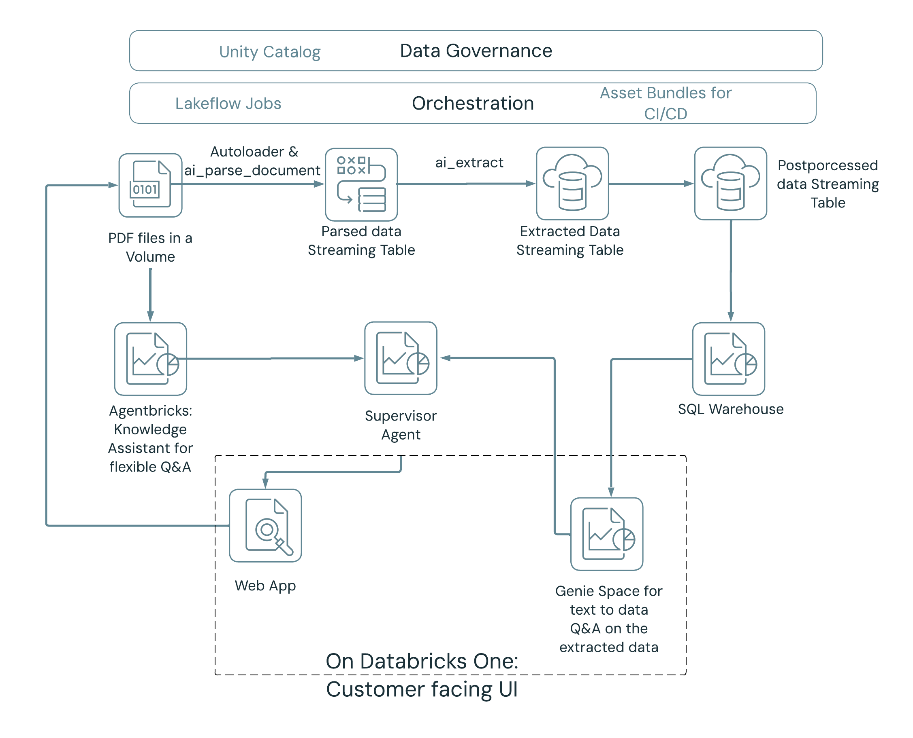

# 📱 Databricks App: Data Extraction UI

A full-stack app for uploading PDFs, triggering the extraction pipeline, querying results, and chatting with the Supervisor Agent — built with FastAPI + React using the [APX framework](https://github.com/databricks-solutions/apx).



*The Databricks App corresponds to the **Web App** box in the bottom-left of the diagram — the customer-facing entry point on Databricks One that ties the Supervisor Agent, Genie Space, and extraction pipeline together.*

> **This bundle must be deployed from your local CLI.** The workspace bundle UI is not supported for app bundles.

---

## 🛠️ Tech Stack

- **Backend:** Python + [FastAPI](https://fastapi.tiangolo.com/)
- **Frontend:** React + [shadcn/ui](https://ui.shadcn.com/)
- **API Client:** Auto-generated TypeScript client from OpenAPI schema
- **Framework:** [APX](https://github.com/databricks-solutions/apx)

---

## 🔧 Prerequisites

- Databricks CLI installed and configured (see [Install the Databricks CLI](https://docs.databricks.com/en/dev-tools/cli/index.html#install-the-databricks-cli))
- The ETL pipeline deployed and a job run completed (see [`../databricks_etl/README.md`](../databricks_etl/README.md))

> **Bundle root is `databricks_app/`**. Run all commands from this directory.

---

## ⚙️ Configure `app.yml`

Edit [`app.yml`](app.yml) before deploying. Set the following environment variables:

| Variable | Purpose |
|----------|---------|
| `WAREHOUSE_ID` | SQL warehouse ID for query execution |
| `JOB_ID` | Job ID of the extraction job triggered from the app |
| `VOLUME_PATH` | Volume path for PDF uploads, e.g. `/Volumes/<catalog>/<schema>/<volume>/` |
| `AI_EXTRACT_PROCESSED_TABLE` | Full table name (`catalog.schema.table`) for extraction results |
| `AGENT_ENDPOINT` | Serving endpoint name for the Supervisor Agent |

---

## 🚀 Deploy

### 1. Set up your Databricks CLI profile

Configure the CLI with a Personal Access Token (PAT) for your workspace:

```bash
databricks configure --profile <profile>
```

### 2. Check proxy settings

If you are using a PyPI or npm proxy, ensure your `uv.toml` and `npm` config point to the correct registries before proceeding.

### 3. Install dependencies

```bash
cd databricks_app && uv sync
```

### 4. Deploy the bundle

```bash
databricks bundle deploy -p <profile>
```

The app is deployed with the name defined in [`databricks.yml`](databricks.yml) under `variables.app_name`.

### 5. Start the app

Open your workspace, navigate to **Compute → Apps**, find your app by the name configured in `databricks.yml`, and click **Start**.

### 6. Sync files

```bash
databricks apps deploy <app-name> --source-code-path /Workspace/Users/<your-email@company.com>/.bundle/data-extraction-app/dev/files/.build
```

---

## 👥 App User Permissions

Users of the app need access to the underlying resources it calls:

| Resource | Required privilege |
|----------|--------------------|
| Volume | Read / write |
| Processed table | `SELECT` |
| SQL warehouse | `CAN_USE` |
| Extraction job | `CAN_MANAGE_RUN` |
| Agent serving endpoint | `CAN_QUERY` |

---

## 🔗 References

- [Deploy Databricks Apps with Asset Bundles](https://docs.databricks.com/aws/en/dev-tools/bundles/apps-tutorial)
- [APX framework](https://github.com/databricks-solutions/apx)
